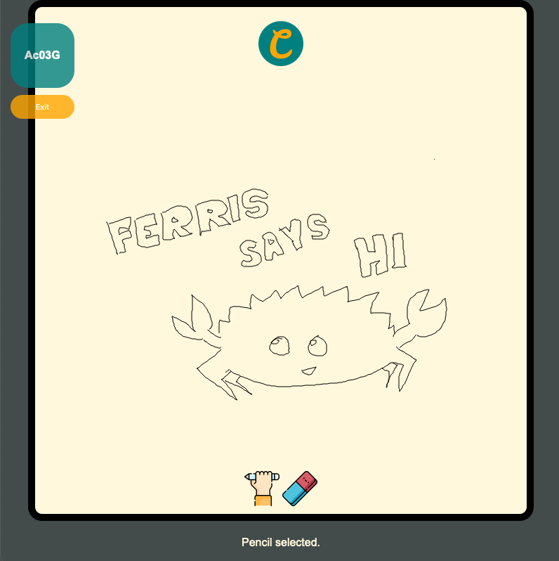

# Collaboard - a collaborative whiteboard

A collaborative whiteboard that allows users in the same room to draw on the same canvas. :pencil:


### How to use?

1. Create a room.
2. Give the 5 digits alphanumeric code to your friends.
3. Draw and exchange ideas on the same canvas.


### What is needed?

Install [rust-lang and cargo](https://www.rust-lang.org/tools/install) before running Collaboard.

```
cargo install wasm-pack
```


### Run Collaboard in localhost

Clone or download the repo, then run in terminal

```
cd collaboard-front
wasm-pack build --target web --out-name collaboard --out-dir ./static
```
Copy the following into *collaboard-back/static* and *collaboard-back/template*
* collaboard.js
* collaboard_bg.wasm
* snippets folder

```
cd collaboard-back
cargo run
```

Navigate to localhost:5000 (default) on your browser, you should see Collaboard running.

*.env* is available in both folder if you want to change the websocket listening port or host IP.





## Made possible with

* [stdweb](https://github.com/koute/stdweb)
* [actix-web](https://actix.rs/)


## Authors

* **Alex Wong** - *Pet project* - [Owlullaby](https://github.com/Owlullaby)


## License

This project is licensed under the [MIT License](https://github.com/Owlullaby/Collaboard/blob/master/LICENSE). 


## Acknowledgments

* This is a pet project done to practice Rust language and to answer the question: Are Rust web yet?